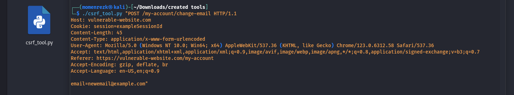
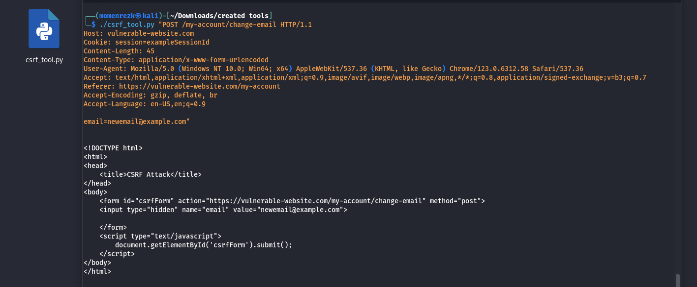

# CSRF Payload Generation Tool

This tool helps generate CSRF (Cross-Site Request Forgery) payloads based on a given HTTP request. It creates an HTML form that submits a request to a vulnerable endpoint, simulating a CSRF attack.

## Prerequisites

- Python 3.x installed on your system.
- Basic knowledge of CSRF attacks and HTTP requests.

## Installation

1. **Clone the Repository**

   Clone this repository to your local machine:

   ```sh
   git clone https://github.com/Momenrezk90/csrf_tool.git
   cd csrf_tool

## Make the Script Executable

   Change the permissions of the script to make it executable:

   chmod +x csrf_tool.py

## EX Of USE 



## the output 




